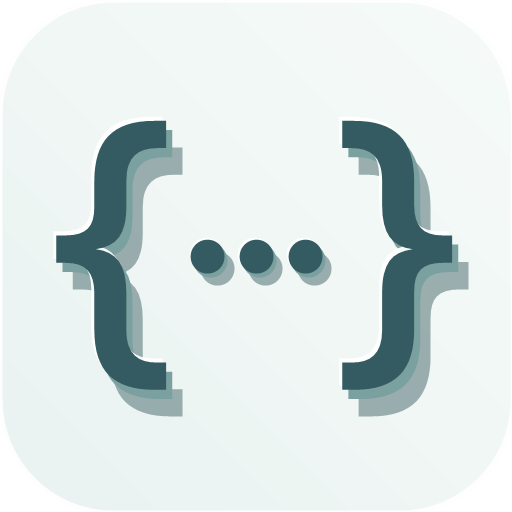

<div align="center">
  
  <h1>合社JSON</h1>
  <p><strong>轻量、专注的现代化 JSON 编辑与校验工作台</strong></p>
  
  [](https://opensource.org/licenses/MIT) [](https://github.com/scutken/json-tools/stargazers) [](https://reactjs.org/) [](https://www.typescriptlang.org/) [](https://vitejs.dev/) [](https://tailwindcss.com/) [](https://nodejs.org/)
  
</div>

> 本项目 fork 自 [fevrax/json-tools](https://github.com/fevrax/json-tools)，在原项目基础上做了大量样式与交互调整。

## ✨ 特性

合社JSON 是一个专注的 JSON 工作台，提供直观界面和高效编辑能力，帮助开发者处理、校验和查看 JSON 数据。

- 🚀 **多视图模式**：支持文本视图、差异对比视图和表格视图
- 🎨 **深色/浅色主题**：适应各种工作环境和个人偏好 
- 🔄 **视图切换**：快速在不同视图模式间切换
- 🧩 **多标签页**：支持同时打开多个JSON文件处理
- 🔍 **字符解码器**：自动识别并解码常见编码格式

## 🔥 核心功能

### 多视图JSON编辑器

- **文本视图**：基于Monaco Editor的专业代码编辑体验
- **差异对比视图**：方便对比JSON数据差异
- **表格视图**：以表格形式展示JSON数据

### 字符解码解码器

- **时间戳解码器**：自动识别并将时间戳转换为可读日期时间格式
- **Base64解码器**：检测并解码Base64编码字符串
- **Unicode解码器**：自动解码Unicode转义序列为可读字符
- **URL解码器**：识别并解码URL编码的字符串
- **可配置性**：支持全局或按编辑器实例单独启用/禁用解码器

### JSON 修复

- **自动修复**：使用 jsonrepair 自动修复常见格式错误


## 🐳 Docker 部署

### 使用 Docker Compose（推荐）

```bash
# 构建并启动容器
docker-compose up -d

# 访问 http://localhost:3300
```

### 使用 Docker 命令

```bash
# 构建镜像
docker build -t json-tools-next .

# 运行容器
docker run -d -p 3300:80 --name json-tools json-tools-next

# 访问 http://localhost:3300
```

## 🚀 快速开始

### 安装依赖

```bash
# 使用pnpm（推荐）
pnpm install

# 或使用npm
npm install

# 或使用yarn
yarn install
```

### 开发环境

```bash
pnpm dev
```

### 构建生产版本

```bash
pnpm build
```

### 预览生产构建

```bash
pnpm preview
```


## 🤝 贡献

欢迎提交PR、创建Issue或提供功能建议！请查看[贡献指南](CONTRIBUTING.md)了解更多。

## 📝 提交规范

详情查看：[CONTRIBUTING.md](./CONTRIBUTING.md)

本项目使用 [semantic-release](https://github.com/semantic-release/semantic-release) 进行版本管理和自动发布。
为确保正确生成版本号和更新日志，请遵循以下提交消息格式：

```
<type>(<scope>): <subject>

<body>

<footer>
```

### 提交类型（type）

- `feat:` 新功能（触发 minor 版本更新）
- `fix:` 修复bug（触发 patch 版本更新）
- `docs:` 文档更新（不触发版本更新）
- `style:` 代码风格变更（不影响代码功能，不触发版本更新）
- `refactor:` 代码重构（不触发版本更新）
- `perf:` 性能优化（触发 patch 版本更新）
- `test:` 测试相关（不触发版本更新）
- `build:` 构建系统或外部依赖变更（不触发版本更新）
- `ci:` CI配置变更（不触发版本更新）
- `chore:` 其他变更（不触发版本更新）
- `revert:` 撤销之前的提交（触发 patch 版本更新）

### 示例

```
feat(editor): 添加JSON格式化快捷键

添加Ctrl+Shift+F快捷键用于格式化JSON

BREAKING CHANGE: 修改了之前的格式化行为
```

提交符合规范的消息后，semantic-release 会：
1. 根据提交类型自动确定版本号变更（major/minor/patch）
2. 自动生成更新日志（CHANGELOG.md）
3. 创建Git标签
4. 发布GitHub Release


## 📈 Stargazers over time
[](https://starchart.cc/scutken/json-tools)

## 🙏 致谢

感谢以下优秀项目的支持：

- [Cursor](https://www.cursor.com/) - 强大的AI代码编辑器
- [uTools](https://u.tools/) - 高效的效率工具平台
- [Monaco Editor](https://microsoft.github.io/monaco-editor/) - 专业的代码编辑器组件

## 📜 许可证

[MIT License](LICENSE) © 2025 JSON Tools Next contributors. 合社JSON 保留原项目版权声明，并标注本分支修改。
